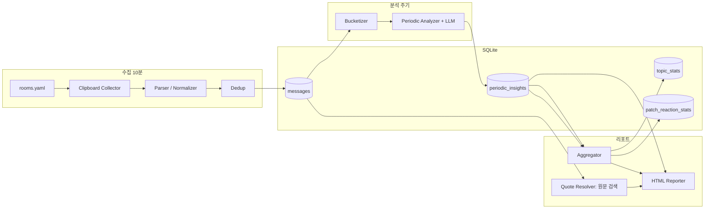

# 개발 계획서 (development-plan.md)

본 문서는 `design.md`를 구현하기 위한 **단계·아키텍처·통계 정의**를 정리한다.  
현재 동작 확인된 `kakao_clipboard_crawler.py`를 1차 Collector로 두고, SQLite·주기별 LLM 분석·HTML 리포트까지 촘촘한 단계로 확장한다.

**확정 운영 가정**

| 항목 | 값 |
|------|-----|
| 모니터링 방 수 | 20개 이상 |
| 방 제목 매칭 | 설정에 등록한 **완전 일치** 제목만 (안 읽음 수 `(N)` 접미사는 매칭 전 제거) |
| 수집 주기 | 10분 |
| 채팅방 상태 | PC 카카오톡에서 **항상 열어둔 상태** (닫힌/미발견 방은 해당 사이클 스킵) |
| 원시 텍스트 보관 | **7일** (`retention.raw_days=7`) |
| 저장소 | 처음부터 **SQLite** 단일 DB |
| Analyzer LLM | **EXAONE 3.5 7.8B Instruct** + GGUF **4-bit `Q4_K_M`** ([HF](https://huggingface.co/LGAI-EXAONE/EXAONE-3.5-7.8B-Instruct-GGUF)), Ollama 등 OpenAI 호환 API |
| Reporter LLM | **`.env`** 의 `REPORTER_*` 로 프로바이더·모델·API 키 결정 |
| 수집 방식 | 클립보드 Ctrl+A/C (`EVA_VH_ListControl_Dblclk`) — UIAutomation/OCR **미사용** |

---

## 1. 목표와 범위

### 1.1 이번 계획에서 다루는 것

- 다중 방(20+) 주기 수집, 방별 격리, 중복 제거, SQLite 적재
- 카카오 클립보드 텍스트 **파싱·정규화** (이미지/이모티콘/삭제 메시지 제외)
- 주기별 LLM 분석 → 인사이트 스토어
- **주제·태그 빈도 추이**, **패치/업데이트 반응** 집계
- 리포트 HTML: 요약 + 통계 + **원문 검색 기반 예시 인용**(마스킹 없음, 원문 그대로)

### 1.2 이번 계획에서 제외하는 것

| 제외 항목 | 비고 |
|-----------|------|
| 시간대별 메시지 건수 통계 | 운영 우선순위 외 |
| 방 간 비교 표·차트 | |
| 이상치(z-score) 탐지 | |
| 신조어·반복 키워드 전용 통계 | |
| 감성 추이 | 스키마·Aggregator에서도 제거 |
| 닉네임 마스킹 | |
| UIAutomation / OCR | 설계·구현 모두 제외 |
| UI 설정 앱 | 초기는 설정 파일 + CLI; UI는 후속 |

---

## 2. 수집 텍스트 형식 (captures 샘플 기준)

`captures/*.txt` 헤더 이후 본문 예:

```text
2026년 5월 13일 수요일
[군터] [오후 5:40] 먹는재미가 없으니 ㅋ
[조우/요정/붉사] [오후 5:40] 아니 데스칼질로 ...
9메일 9일도 다 쓰레기 7싸울승
[오픈채팅봇] [오후 5:57] 리니지 클래식 거래할 땐 ...
```

### 2.1 파서 규칙 (Normalizer)

| 유형 | 패턴·처리 |
|------|-----------|
| 날짜 구분선 | `^\d{4}년 \d{1,2}월 \d{1,2}일` → 현재 메시지의 `message_date` 컨텍스트 |
| 일반 메시지 | `^\[(.+?)\] \[(오전\|오후) \d{1,2}:\d{2}\] (.*)$` → `nick`, `time`, `body` |
| 연속 본문 | 직전 메시지와 동일 `nick`·`time`이 없으면 **이전 메시지 body에 append** |
| 시스템·봇 | `[오픈채팅봇]` 등 설정 가능한 `exclude_nicks` → **저장·분석 제외** (선택: `meta` 태그만 별도 집계 가능하나 기본 제외) |
| 이미지/이모티콘 | `(사진)`, `(이모티콘)`, `이모티콘을 보냈습니다` 등 패턴 → **제외** |
| 삭제된 메시지 | `삭제된 메시지`, `메시지를 삭제했습니다` 등 → **제외** |
| URL·공지성 반복 | 봇·고정 공지는 `exclude_nicks`로 1차 제거 |

파싱 결과는 `messages` 테이블에 **메시지 1행 = 논리 메시지 1건**으로 insert.  
`content_hash = hash(room_id + nick + message_at + normalized_body)` 로 수집·스크롤 중복 제거.

### 2.2 창 제목 정규화

- 카카오 제목 예: `리니지 클래식 종합 커뮤니티 리니지클래식 (3)`
- 매칭: `normalize_title(title) = re.sub(r'\s*\(\d+\)\s*$', '', title)` 후 `rooms` 설정값과 **완전 일치**
- `room_id`: 설정의 `canonical_title` 해시 또는 slug (HWND는 보조 키만)

---

## 3. 아키텍처



| 모듈 | 책임 |
|------|------|
| **Clipboard Collector** | 방 목록 순회, 리스트 컨트롤 Ctrl+A/C, 클립보드 복원, 방별 격리 |
| **Diff / Dedup** | 방별 `last_snapshot` 또는 DB `content_hash`로 신규 메시지만 insert |
| **Parser** | §2.1 규칙, 제외 패턴 필터 |
| **Bucketizer** | `analyzer.period` 기준 `period_key` 부여 |
| **Periodic Analyzer** | 버킷별 원시 메시지 + 패치노트 컨텍스트 → JSON 인사이트 (**EXAONE 3.5 7.8B Instruct**) |
| **Aggregator** | 인사이트 누적 → **태그·주제 빈도 추이**, **패치 반응 누적**만 |
| **Quote Resolver** | 리포트 생성 시 `quote_search_keys` 또는 `message_id`로 `messages` **원문 LIKE/정확 검색** → HTML에 원문 삽입 |
| **Model router** | `.env`의 `ANALYZER_*`(기본 EXAONE 3.5 7.8B), `REPORTER_*` 읽어 API/CLI 호출 |

---

## 4. SQLite 스키마 (개요)

단일 파일 예: `data/openchat.db`

### 4.1 `rooms`

| 컬럼 | 설명 |
|------|------|
| `room_id` | PK, slug |
| `canonical_title` | 설정 제목 (안 읽음 수 없음) |
| `label` | 리포트 표시명 |
| `enabled` | 수집 대상 여부 |

### 4.2 `messages` (원시, 7일 TTL)

| 컬럼 | 설명 |
|------|------|
| `message_id` | PK |
| `room_id` | FK |
| `collected_at` | 수집 시각 |
| `message_at` | 파싱된 발화 시각 (날짜 구분선 + 오전/오후) |
| `nick` | 원문 닉네임 |
| `body` | 본문 |
| `content_hash` | 중복 키 |
| `tag_hints` | NULL (분석 후 채울 수 있음, 선택) |

인덱스: `(room_id, message_at)`, `(room_id, content_hash UNIQUE)`, `(body)` — 리포트용 원문 검색은 FTS5 검토(후속), 초기는 `message_id` 직접 참조 우선.

### 4.3 `collect_runs` (운영 메타)

| 컬럼 | 설명 |
|------|------|
| `run_id`, `started_at`, `room_id`, `status`, `new_message_count`, `error` |

### 4.4 `periodic_insights`

`design.md` §5.3.4 스키마 기준. **감성·new_terms·notable_user_hashes 필드는 사용하지 않음.**

### 4.5 `topic_stats` (집계 캐시)

| 컬럼 | 설명 |
|------|------|
| `period_key`, `period_type`, `room_id` (NULL=전체 합산) | |
| `tag`, `topic_key`, `title` | |
| `mentions` | LLM/규칙이 산출한 언급량 |
| `distinct_nicks` | 해당 주제에 기여한 **서로 다른 닉 수** |
| `messages_referenced` | 인용·근거로 잡힌 메시지 id 수 |

### 4.6 `patch_reaction_stats`

| 컬럼 | 설명 |
|------|------|
| `period_key`, `patch_item`, `stance`, `mentions`, `distinct_nicks`, `summary` | |

---

## 5. 통계 정의

운영·리포트에 쓰는 통계는 **아래 두 축만** 한다.

### 5.1 주제·태그 빈도 추이

**입력**: `periodic_insights.topics[]` — `tag`, `title`, `mentions`, (선택) `topic_key`

**집계 방법**

| 지표 | 계산 |
|------|------|
| `mentions_by_period` | `period_key` × `tag`(또는 `topic_key`)별 `mentions` 합산 |
| `top_topics` | 리포트 윈도우 내 `mentions` 상위 N |
| `tag_share` | 동일 `period_key` 내 태그별 `mentions` 비율 |

**시각화**: HTML 리포트에 태그별 막대/라인(Chart.js 등) — **기간(period_key) 축**만 사용, 시간대·방 간 비교 차트는 만들지 않음.

**소수가 다수를 대표하는 문제 완화** (분석·집계 공통 규칙)

Periodic Analyzer 프롬프트와 Aggregator 후처리에서 다음을 **필수**로 한다.

1. 주제별 `distinct_nicks`: 해당 기간·방에서 그 주제 본문에 실제로 말한 **고유 닉네임 수** (파서 `nick` 기준).
2. `mentions`는 메시지 건수 또는 언급 횟수로 정의하되, 리포트·상위 주제 선정 시 **`distinct_nicks >= min_distinct_nicks`** (기본 3, `.env` 또는 설정) 미만이면 **“표본 부족”** 플래그, 상위 주제 후보에서 제외 또는 각주 처리.
3. 동일 `nick`의 연속 짧은 반응(ㅋㅋ, 동의)은 `mentions` 가중 **1건으로 상한** (프롬프트 지시 + 가능하면 규칙 후처리).
4. 상위 주제 정렬 키: `mentions` 단독 금지 → `sort_key = mentions * min(1, distinct_nicks / min_distinct_nicks)` 또는 `distinct_nicks` 우선, `mentions` 보조.

리포트 문구 예: *「7싸울 밸런스」(언급 41, 참여 닉 12)* — 소수 독백은 각주로 *「참여 닉 1 — 표본 부족」*.

### 5.2 패치/업데이트 반응

**입력**: Context loader의 **업데이트 노트·패치 항목 목록** + `periodic_insights.patch_reactions[]`

**집계 방법**

| 지표 | 계산 |
|------|------|
| `patch_mentions_by_period` | `patch_item` × `period_key`별 `mentions` |
| `stance_distribution` | `negative \| neutral \| positive \| mixed` 건수·비율 (기간 누적) |
| `gap_topics` | 노트에 **없는** 패치 키워드인데 `mentions` 상위인 `topics` — 운영 우선순위 후보 |

패치 반응에도 `distinct_nicks`·`min_distinct_nicks` 동일 적용.

### 5.3 예시 인용 (리포트용)

분석 단계에서 LLM이 **검색 키워드·message_id 후보**만 JSON에 넣고, HTML 생성 시 **Quote Resolver**가 수행한다.

| 단계 | 동작 |
|------|------|
| Analyzer 출력 | `quote_refs: [{ "message_id": 12345 }]` 또는 `{ "search_phrase": "7싸울", "room_id": "...", "around": "2026-05-12" }` |
| Resolver | `messages`에서 `message_id` 정확 조회, 또는 `body LIKE` / 동일 문장 해시 매칭 |
| HTML | **원문 `body` 그대로** 인용 블록 삽입 (닉·시간 포함 가능) |
| 검증 실패 | 인용 생략 + 리포트 메타에 `quote_miss_count` |

할루시네이션 방지: HTML에 넣는 문자열은 **반드시 DB `messages.body`에서만** 가져온다 (LLM 생성 인용문 직접 삽입 금지).

---

## 6. `.env` 설계

```env
# 공통
TZ=Asia/Seoul
DATABASE_PATH=data/openchat.db
RETENTION_RAW_DAYS=7

# 수집
COLLECT_INTERVAL_MINUTES=10
MIN_DISTINCT_NICKS=3
ROOMS_CONFIG=config/rooms.yaml
CAPTURES_DIR=captures
STATE_DIR=data/state
# NO_RESTORE_CLIPBOARD=true
# ROOM_TIMEOUT_SECONDS=30

# 분석 (Periodic Analyzer) — EXAONE 3.5 7.8B Instruct, GGUF 4-bit Q4_K_M (확정)
# https://huggingface.co/LGAI-EXAONE/EXAONE-3.5-7.8B-Instruct-GGUF
# 파일: EXAONE-3.5-7.8B-Instruct-Q4_K_M.gguf (~5GB VRAM)
# Ollama: ollama run hf.co/LGAI-EXAONE/EXAONE-3.5-7.8B-Instruct-GGUF
ANALYZER_PROVIDER=openai
OPENAI_API_BASE=http://localhost:11434/v1
ANALYZER_MODEL=EXAONE-3.5-7.8B-Instruct
ANALYZER_QUANTIZATION=Q4_K_M
ANALYZER_GGUF_REPO=LGAI-EXAONE/EXAONE-3.5-7.8B-Instruct-GGUF
ANALYZER_API_KEY=ollama
ANALYZER_PERIOD=1d
ANALYZER_PROMPT_VERSION=v1

# 리포트 합성
REPORTER_PROVIDER=openai
REPORTER_MODEL=gpt-5.2
REPORTER_API_KEY=
REPORTER_OPENAI_API_BASE=https://api.openai.com/v1
REPORTER_WINDOW=7d

# 경로
PATCHNOTES_PATH=docs/patchnotes.md
ROADMAP_PATH=docs/roadmap.md
OUTPUT_DIR=reports
```

애플리케이션은 시작 시 `.env` 로드 → 설정 객체에 매핑. 키 누락 시 명확한 오류 메시지.

### 6.1 Periodic Analyzer LLM (확정)

주기별 분석(`python -m openchat analyze`)은 **EXAONE 3.5 7.8B Instruct**만 사용한다.

| 항목 | 값 |
|------|-----|
| 모델 | [LGAI-EXAONE/EXAONE-3.5-7.8B-Instruct](https://huggingface.co/LGAI-EXAONE/EXAONE-3.5-7.8B-Instruct) |
| GGUF (로컬) | [EXAONE-3.5-7.8B-Instruct-GGUF](https://huggingface.co/LGAI-EXAONE/EXAONE-3.5-7.8B-Instruct-GGUF) |
| 양자화 (확정) | **4-bit `Q4_K_M`** — `ANALYZER_QUANTIZATION=Q4_K_M`, 파일 `EXAONE-3.5-7.8B-Instruct-Q4_K_M.gguf` (~5GB VRAM) |
| 컨텍스트 | 32,768 토큰 (긴 일간 버킷·2-stage 분할 전 1차 입력에 활용) |
| 호출 방식 | Ollama 등 **OpenAI 호환** `chat/completions` (`ANALYZER_PROVIDER=openai` + `OPENAI_API_BASE`) 또는 동등 로컬 런타임 |
| 출력 | `design.md` §5.3.4 고정 JSON 스키마; `analyzer_model` 컬럼·메타에 `EXAONE-3.5-7.8B-Instruct@Q4_K_M` (`settings.analyzer_model_label`) |

리포트 합성(`REPORTER_*`)은 Analyzer와 분리하며, Reporter 모델은 본 문서에서 고정하지 않는다.

> **구현 상태**: `openchat analyze`는 기본적으로 Ollama 등 OpenAI 호환 API로 EXAONE을 호출한다. `--heuristic` 또는 `ANALYZER_USE_LLM=false`로 휴리스틱만 사용 가능.

---

## 7. 개발 단계 (촘촘한 로드맵)

| 단계 | ID | 산출물 | 완료 기준 |
|------|-----|--------|-----------|
| **0** | PoC | `kakao_clipboard_crawler.py` | 단일 방 캡처·`captures/` 저장 ✓ (완료) |
| **1a** | 다중 방 수집 | `collector/runner.py` | `config/rooms.yaml` 기반 다중 방 순차 캡처, 제목 정규화, 방별 diff ✓ (완료) |
| **1b** | Watch 모드 | `python -m openchat collect --watch` | 10분 주기 루프, 실패 방 스킵, 클립보드 복원 ✓ (완료) |
| **2a** | SQLite | `db/schema.sql`, `db/connection.py`, `db/messages.py` | `messages` insert, `content_hash` 중복 무시 ✓ (완료) |
| **2b** | Parser | `parser/kakao_clipboard.py` | 샘플 캡처 회귀 테스트, 제외 패턴 적용 ✓ (완료) |
| **2c** | Retention | `jobs/purge_raw.py`, `python -m openchat purge` | 7일 초과 `messages` 삭제 ✓ (완료) |
| **3a** | Bucketizer | `analyzer/bucketizer.py`, `python -m openchat bucketize` | `period_key` 부여, 미분석 버킷 큐 ✓ (완료) |
| **3b** | Analyzer | `analyzer/periodic.py`, `db/insights.py`, `python -m openchat analyze` | `periodic_insights` 적재, `topics`·`distinct_nicks` 생성 ✓ (완료; LLM은 **EXAONE 3.5 7.8B** 연동 예정) |
| **3d** | Analyzer LLM | `analyzer/llm.py`, `analyzer/prompts.py`, `analyzer/periodic.py` | EXAONE 3.5 7.8B Instruct로 버킷 JSON 분석, heuristic 폴백 ✓ (완료) |
| **3c** | Idempotent | `db/insights.py`, `python -m openchat analyze --force` | 동일 `(room_id, period_key, version)` 재실행 시 upsert 덮어쓰기 ✓ (완료) |
| **4a** | Aggregator | `stats/aggregator.py`, `python -m openchat aggregate` | `topic_stats`, `patch_reaction_stats` 갱신 ✓ (완료) |
| **4b** | Quote resolver | `report/quote_resolver.py` | message_id·search_phrase → 원문 조회 ✓ (완료) |
| **5a** | HTML 리포트 | `report/render_html.py`, `python -m openchat report` | 주제·태그 추이, 패치 반응, 원문 인용 섹션 ✓ (완료) |
| **5b** | Context | `context/loader.py` | 패치노트·로드맵 파일 주입 ✓ (완료) |
| **6** | 스케줄 | CLI/cron | `collect`, `analyze`, `report` 서브커맨드, Windows 작업 스케줄러 연동 문서 |
| **7** | 운영 | 문서·관측 | `collect_runs` 대시보드(텍스트 로그), 커버리지 낮음 방 알림 |

단계 **1~2**를 묶어 “수집 파이프라인 MVP”, **3~4**를 “인사이트·통계”, **5~6**을 “리포트·자동화”로 본다.

---

## 8. `kakao_clipboard_crawler.py` → 제품 코드 이전

| 현재 | 이전 후 |
|------|---------|
| 단일 `--room` | `rooms.yaml` 전체 순회 |
| `find_room_window` 1건 | `find_room_windows(normalize_title)` |
| `captures/kakao_capture_*.txt` | 파싱 후 DB `messages` 적재 + 선택적 캡처 파일(`captures/{room_id}/...`) |
| 1회 실행 | `python -m openchat collect` |
| 10분 주기 실행 | `python -m openchat collect --watch` |
| 파일 타임스탬프 dedup 없음 | `content_hash` + overlap diff |

핵심 로직(`post_key_ex`, `LIST_CONTROL_CLASS`, `normalize_kakao_text`)은 `collector/clipboard.py`로 이동하고 크롤러 CLI는 얇은 래퍼로 유지 가능.

---

## 9. 설정 파일 예 (`config/rooms.yaml`)

```yaml
rooms:
  - id: lineage-classic-main
    title: "리니지 클래식 종합 커뮤니티 리니지클래식"
    label: "리니클 종합"
    enabled: true
    update_notes_url: "https://example.com/game/news/"  # 하위에 패치 글 목록
  # ... 20개 이상
exclude_nicks:
  - "오픈채팅봇"
exclude_body_patterns:
  - "사진"
  - "이모티콘"
  - "삭제된 메시지"
```

---

## 10. 리스크 (개발 관점)

| 리스크 | 완화 |
|--------|------|
| 20방 × 10분 = 클립보드 순차 부하 | 방당 타임아웃, 실패 시 다음 방 |
| 스크롤 밖 과거 메시지 미수집 | 리포트에 coverage 표기; 중요 이슈는 운영자가 방 스크롤 유지 |
| 제목 `(N)` 변동 | `normalize_title` |
| LLM `mentions` 과대 | `distinct_nicks`·`min_distinct_nicks`·정렬 키 |
| EXAONE 로컬 VRAM 부족 | Q4_K_M·방당 2-stage 분할; 실패 시 heuristic 폴백 |
| 인용 오류 | Quote Resolver는 DB 원문만 |

---

## 11. `design.md`와의 관계

- 아키텍처·용어·데이터 흐름의 **정본**은 `design.md`.
- 본 문서는 **구현 순서·통계 수식·환경 변수·파서 규칙**의 실행 계획.
- 변경 시 두 문서의 **문서 이력**에 버전을 남긴다.

---

## 문서 이력

| 버전 | 날짜 | 요약 |
|------|------|------|
| 1.0 | 2026-05-22 | 초안: 운영 가정 반영, 통계 범위 축소, SQLite·.env·단계별 로드맵, captures 샘플 기반 파서 |
| 1.1 | 2026-05-26 | 1a~2c 구현 반영: 다중 방 수집/Watch/SQLite 적재/파서/Retention/CLI(`purge`) 완료 표시, `.env` 키 추가 |
| 1.2 | 2026-05-26 | 3a~3c 구현 반영: Bucketizer/Analyzer/Idempotent upsert, CLI(`bucketize`, `analyze`, `analyze --force`) 추가, `periodic_insights` 적재 시작 |
| 1.3 | 2026-05-26 | 4a~5b 구현 반영: Aggregator/Quote Resolver/Context/HTML report, CLI(`aggregate`, `report`) 추가 |
| 1.4 | 2026-05-26 | Periodic Analyzer LLM 확정: EXAONE 3.5 7.8B Instruct, §6.1·`.env` 예시·로드맵 3d 추가 |
| 1.5 | 2026-05-26 | Analyzer GGUF 양자화 확정: 4-bit Q4_K_M, `ANALYZER_QUANTIZATION`·`.env.example`·`config.py` 정렬 |
| 1.6 | 2026-05-26 | 3d 구현: `analyzer/llm.py`·프롬프트·EXAONE OpenAI 호환 호출, heuristic 폴백, `guide.md` Ollama 설치 안내 |
| 1.7 | 2026-05-26 | Reporter LLM: `report/synthesize.py`·`reporter_prompts.py`·Chart.js 차트, `REPORTER_*` 설정, 정적 폴백 |
